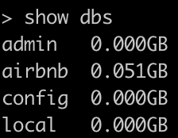

## Sample data for testing


There is available sample data [here](https://docs.atlas.mongodb.com/sample-data/available-sample-datasets/) you can load into MongoDB Atlas cluster.

But there is no easy way to load it into your local machine. Fortunately there there other sources such as this [github repo](https://github.com/huynhsamha/quick-mongo-atlas-datasets) where you can download same data

We will use sample Airbnb data. After we downloaded data we will load it to local mongodb which is running on port 27017. Make sure mongodb service is running.

```console
mongorestore --host localhost --port 27017 --db airbnb --dir ./dump/sample_airbnb
```
You can check if db is loaded.



